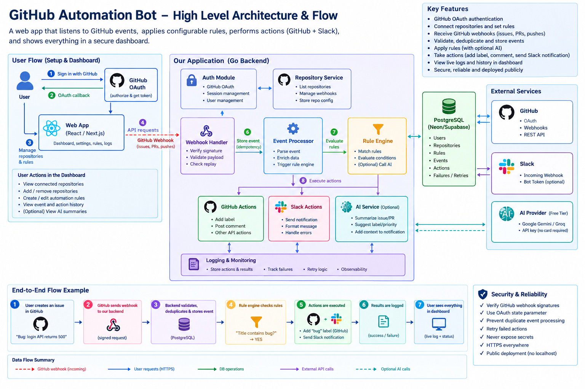

# GitActionFlow

**Event-driven GitHub automation** — connect a repository, define rules, and turn issues & pull requests into GitHub actions and Slack alerts, with a live dashboard of everything that ran.

[Live demo](https://gitactionflow.vercel.app) · [API health](https://gitactionflow-backend.onrender.com/health) · [Architecture](docs/architecture/HLA.md) · [Decisions](docs/decisions/)

```text
webhook → HMAC verify → dedupe → persist → worker → rules → GitHub / Slack → dashboard
```

---

## Why this exists

Teams often want light automation on GitHub events without standing up Actions workflows, bots, or a message bus. GitActionFlow is a focused product for that loop:

1. Sign in with GitHub OAuth  
2. Connect **one** repository you administer  
3. Configure rules (AND conditions → label, comment, Slack)  
4. Receive signed webhooks; process them durably  
5. Review events and action outcomes on a login-gated dashboard  

Built as a modular monolith on free-tier hosting (Neon + Render + Vercel) so the full path stays demoable without paid infrastructure.

---

## Live demo

| | |
| --- | --- |
| **App** | https://gitactionflow.vercel.app |
| **API** | https://gitactionflow-backend.onrender.com |
| **Health** | https://gitactionflow-backend.onrender.com/health |
| **Webhook** | `POST …/webhooks/github` (Issues + Pull requests) |

**Try it:** open the app → Continue with GitHub → connect a repo you admin → add a rule → open an issue that matches. Point the repo webhook at the URL above (secret from your own deploy, or ask me privately for the shared demo).

> Cold start: free Render may sleep — hit `/health` once if the first request is slow.

---

## Features

- **GitHub OAuth** with CSRF `state`, HttpOnly sessions, AES-GCM encrypted tokens at rest  
- **One-repo connect** with live `admin` check (re-fetched from GitHub by id)  
- **Signed webhooks** for `issues` and `pull_request` — HMAC on raw body, delivery-ID idempotency  
- **Durable worker** — Postgres queue with `FOR UPDATE SKIP LOCKED`, retries, stale-lease recovery  
- **Configurable rules** — AND conditions → GitHub label / comment + Slack Incoming Webhook  
- **Intent ≠ executor** — safe retries without blindly double-firing side effects  
- **Dashboard** — connected repo, rules, event history, action statuses / errors  
- **Optional AI** — `AI_ENABLED` (default off); schema-validated suggestions, fail-open  

---

## Architecture



```text
┌─────────────┐     ┌──────────────────────┐     ┌─────────────┐
│  Vercel SPA │────▶│  Go API + worker     │────▶│  Neon PG    │
│  + /api proxy│     │  (Render Docker)     │     │  events /  │
└─────────────┘     └──────────┬───────────┘     │  actions    │
                               │                 └─────────────┘
                    ┌──────────┴───────────┐
                    │ GitHub API · Slack   │
                    └──────────────────────┘
```

| Choice | Why |
| --- | --- |
| Modular monolith (Go + React + Postgres) | One deploy unit; easy to reason about end-to-end |
| Postgres as the queue (`SKIP LOCKED`) | Durable without Redis/Kafka; survives host sleep |
| GitHub OAuth App + one repo | Clear security boundary; fits the product scope |
| Persist before external HTTP | No silent loss if Slack/GitHub blips |
| Vercel proxy for `/api` + `/auth` | First-party cookies (Incognito-safe) |

Design write-ups: [docs/decisions/](docs/decisions/) · [docs/architecture/HLA.md](docs/architecture/HLA.md)

---

## Stack

| Layer | Tech |
| --- | --- |
| Backend | Go, Gin, pgx, Docker on Render |
| Frontend | React, TypeScript, Vite on Vercel |
| Data | PostgreSQL (Neon) |
| Integrations | GitHub OAuth / Webhooks / REST, Slack Incoming Webhook |
| Optional | Gemini / Groq (`AI_ENABLED`) |

---

## Security highlights

- Webhook HMAC-SHA256 on the **raw** body (`hmac.Equal`); forged signatures → 401  
- Unique `X-GitHub-Delivery`; action key `event_id:rule_id:action_type`  
- HttpOnly session cookie; tokens never in the browser or API responses  
- CSRF Origin checks on mutating cookie APIs; CORS locked to `FRONTEND_URL`  
- Secrets only in env / `.env.example` placeholders — never logged  

Details: [SECURITY.md](SECURITY.md)

---

## Local development

Full guide: [docs/setup/LOCAL.md](docs/setup/LOCAL.md)

```bash
cp .env.example .env   # OAuth, SESSION_SECRET, webhook secret, DATABASE_URL
docker compose up -d postgres
cd backend && go run ./cmd/server
cd frontend && npm install && npm run dev
```

Open `http://localhost:5173` (use **localhost**, not `127.0.0.1`).

```bash
cd backend && go test ./...
cd frontend && npm run build
```

---

## Deploy

Runbook: [docs/deployment/README.md](docs/deployment/README.md)

1. Neon → `DATABASE_URL`  
2. Render Docker from `backend/` (`AUTO_MIGRATE=true`)  
3. Vercel from `frontend/` — leave `VITE_API_BASE_URL` **unset** (same-origin proxy)  
4. OAuth App homepage + callback on the **Vercel** host  
5. Repo webhook → Render `/webhooks/github`  

---

## Project docs

| Doc | Purpose |
| --- | --- |
| [AGENTS.md](AGENTS.md) | Locked product constraints for contributors / agents |
| [AI_NOTES.md](AI_NOTES.md) | How AI tools were used while building |
| [CONTRIBUTING.md](CONTRIBUTING.md) | Local workflow & review focus |
| [CHANGELOG.md](CHANGELOG.md) | Release notes |
| [docs/](docs/) | Architecture, ADRs, API, setup, deployment |

---

## License

[MIT](LICENSE)
